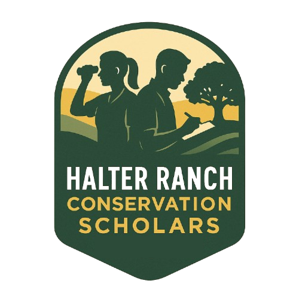
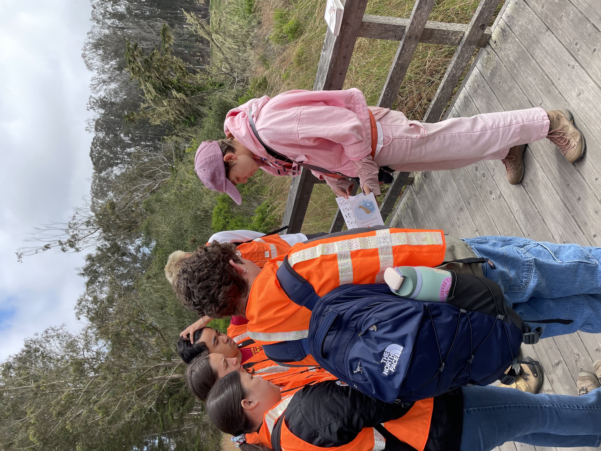
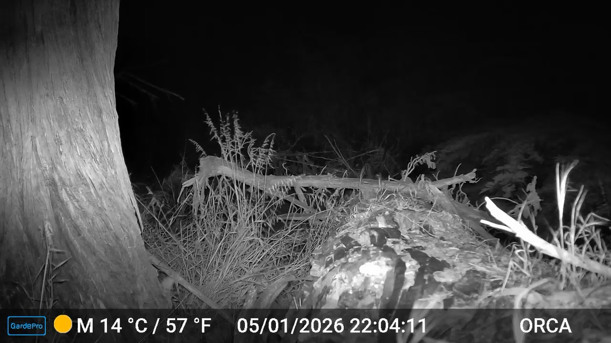

<link rel="stylesheet" href="https://cdn.jsdelivr.net/npm/glightbox/dist/css/glightbox.min.css">

<div class="harcs-header">

<div class="harcs-intro">

The Halter Ranch Conservation Scholars (HARCS) program provides hands-on learning opportunities and financial support for Cal Poly undergraduates pursuing careers in conservation. The program combines a scholarship, a 10-week spring seminar, and a paid summer internship at a partner conservation organization — giving students a continuous *learn-then-apply* pathway from the classroom to an active conservation project.

</div>
</div>

---

### Who the program is for

HARCS is designed for Cal Poly undergraduates with a genuine interest in applied conservation, regardless of major. Successful scholars typically:

- Are curious about California's flora, fauna, and working landscapes.
- Are comfortable spending full days outdoors in variable terrain and weather.
- Are motivated to design, carry out, and communicate an independent project.

No prior research experience is required. Scholars come from biology, environmental management, animal science, agricultural science, and other related programs.

---

### What scholars do

**Spring seminar.** Weekly in-classroom meetings paired with field experiences at reserves and natural areas across San Luis Obispo County. The course culminates in a weekend field trip to a preserve and in final presentations of each scholar's independent project proposal.

**Summer internship.** After the seminar, each scholar transitions to a paid summer internship at a partner conservation organization. The internship is where the scholar's spring proposal becomes a real project: collecting data, contributing to ongoing monitoring, building maps, and producing deliverables the host organization can use.

---

### Partner organizations

- [Rana Creek Preserve](https://wildlandsconservancy.org/ranacreek) — The Wildlands Conservancy
- [Bearpaw Preserve](https://wildlandsconservancy.org/preserves/bearpaw) — The Wildlands Conservancy
- [SLO Land Conservancy](https://lcslo.org/)
- [Bigfoot Trail Alliance](https://www.bigfoottrail.org/)
- [Scott River Watershed Council](http://scottriver.org/)

---

### How to apply

Applications open each fall for the following spring cohort. A link to apply will be provided when the application period opens, and interested students are encouraged to reach out directly.

Contact: Reed Kenny — [rekenny@calpoly.edu](mailto:rekenny@calpoly.edu)

---

### Photos from the field

<p class="harcs-gallery-hint">Click any photo to view full size — use the arrow keys or swipe to step through.</p>

```{=html}
<div class="harcs-gallery">
<a href="HARCS_images/IMG_1404.jpeg" class="glightbox" data-gallery="harcs"></a>
<a href="HARCS_images/IMG_1405.jpeg" class="glightbox" data-gallery="harcs"></a>
<a href="HARCS_images/IMG_1406.jpeg" class="glightbox" data-gallery="harcs"></a>
<a href="HARCS_images/IMG_1408.jpeg" class="glightbox" data-gallery="harcs"></a>
<a href="HARCS_images/IMG_1414.jpeg" class="glightbox" data-gallery="harcs"></a>
<a href="HARCS_images/IMG_1431.jpeg" class="glightbox" data-gallery="harcs"></a>
<a href="HARCS_images/IMG_1433.jpeg" class="glightbox" data-gallery="harcs"></a>
<a href="HARCS_images/IMG_1434.jpeg" class="glightbox" data-gallery="harcs"></a>
<a href="HARCS_images/IMG_1445.jpeg" class="glightbox" data-gallery="harcs"></a>
<a href="HARCS_images/IMG_1462.jpeg" class="glightbox" data-gallery="harcs"></a>
<a href="HARCS_images/IMG_1464.jpeg" class="glightbox" data-gallery="harcs"></a>
<a href="HARCS_images/field_clip.mp4" class="glightbox harcs-video" data-gallery="harcs" data-type="video"><span class="harcs-play"></span></a>
</div>
```

---

*The Halter Ranch Conservation Scholars program is supported by Halter Ranch and partner conservation organizations across California.*

<script src="https://cdn.jsdelivr.net/npm/glightbox/dist/js/glightbox.min.js"></script>
<script>
  document.addEventListener('DOMContentLoaded', function () {
    GLightbox({ selector: '.glightbox', loop: true });
  });
</script>
