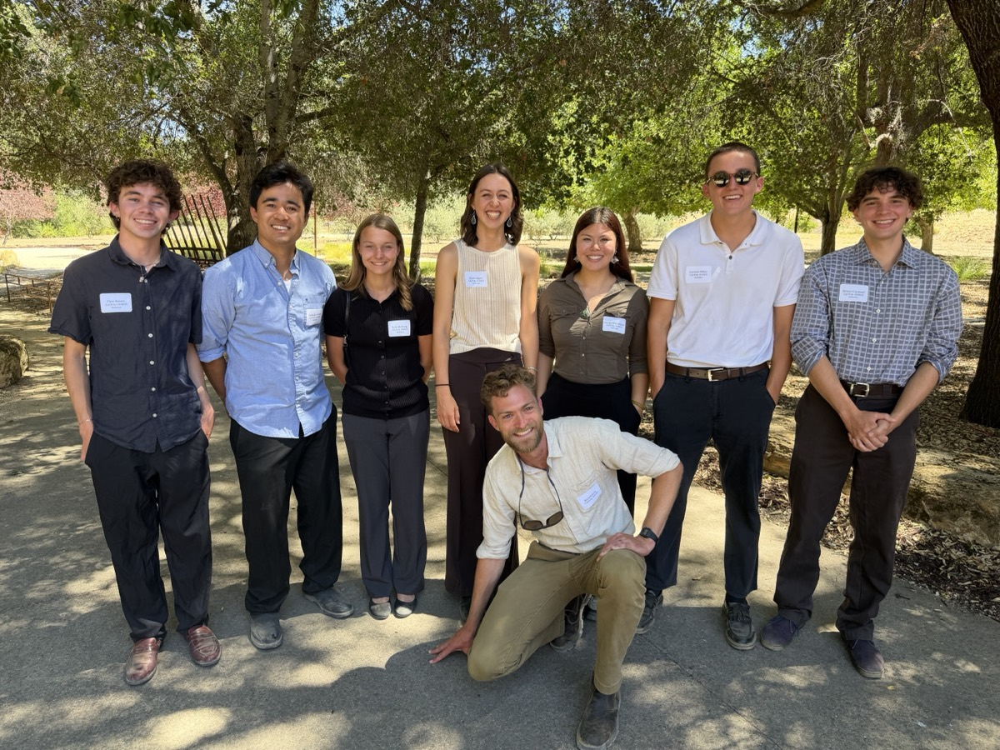
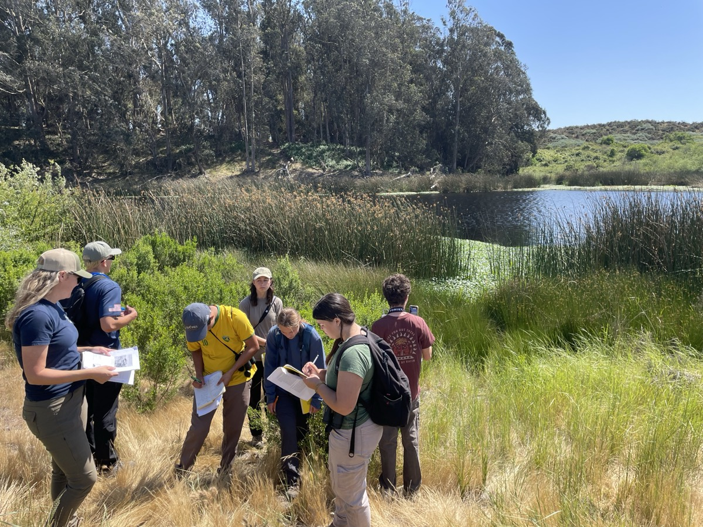

### Halter Ranch Conservation Scholars Program

::: {.figure-section}

<figure class="figure-section-img left">

<figcaption>The inaugural 2026 HARCS cohort.</figcaption>
</figure>

I am currently the Director of the Cal Poly Slo Halter Ranch Conservation Scholars (HARCS) program. This is our inaugural year, and we have placed seven students in summer conservation and stewardship internships with our conservation partners. In preparation, I led those students in a quarter long seminar focused on developing conservation oriented skills such as GIS as well as understanding the fundamentals of conservation and ecology through field based activities. More information about the program is available on the [HARCS page](https://bailey.calpoly.edu/research/undergraduate-research/halter-ranch-conservation-scholars) of the Cal Poly Bailey College of Science and Mathematics website.

:::

### Plant Diversity and Ecology

::: {.figure-section}

<figure class="figure-section-img right">

<figcaption>Field-based learning at Black Lake Preserve, San Luis Obispo County.</figcaption>
</figure>

I will be the instructor of record for the new semester version of Plant Diversity and Ecology this Fall semester at Cal Poly and am designing new material to fit the longer schedule. Plant Diversity and Ecology is an introduction to plant biology, evolution, and ecology geared towards first year students and non biology majors who are interested in learning more about plants. The course has a strong focus on experiential learning, featuring several field trips around San Luis Obispo County to learn the common plants and plant communities of our diverse flora. The Fall 2026 syllabus is available here. [[PDF]](BIO_1114_F2026_Syllabus.pdf)

:::

### Other teaching appointments

Throughout my university career I served as a teaching assistant for courses in botany, ecology, and evolution. I have experience leading lab sections, teaching plant identification, and guiding students through field work. See the below list detailing my university teaching experience. 

**Cal Poly, San Luis Obispo**

- Plant Diversity and Ecology (BIO 1114) 120 students — Fall 2026
- Conservation Ecology Seminar (BIO 472) 6 student — Spring 2026
- Introductory Botany Lab (BOT 121L) 24 students — Fall 2018, 2019
- Plant Diversity and Ecology Lab (BIO 114L) 20 students — Winter 2019, 2020, Spring 2020

**UC Davis**

- Angiosperm Systematics (PLS/PLB 127) 30 students — Spring 2024
- California Floristics (PLB 102) 30 students — Spring 2021, 2022, 2023
- Evolution of the Human Life Cycle (ANT 15) 20 students — Fall 2023
- Environmental Plants (ENH 06) 20 students — Fall 2021

**UC Santa Cruz**

- Systematic Botany of Flowering Plants Lab (BIOE 117L) 25 students — Winter 2017

