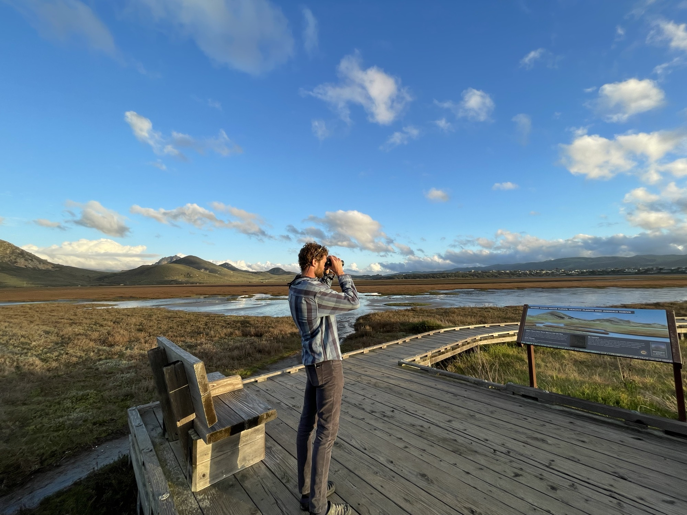
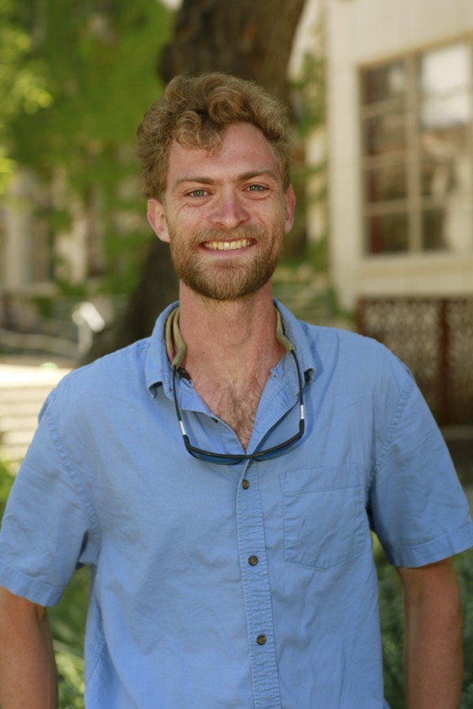

Reed Kenny

Botanist &middot; Director, Halter Ranch Conservation Scholars &middot; Cal Poly San Luis Obispo

I am currently the Director of the Cal Poly San Luis Obispo Halter Ranch Conservation Scholars program as well as a lecturer in the Biology Department at Cal Poly. I am broadly interested in biodiversity and natural resource conservation. This is reflected in my research, which includes cataloging plant diversity on working lands, classifying species, and studying the impacts of fire on urban forests. I earned a Master's degree at Cal Poly San Luis Obispo studying the floristics of the central California coast and a Ph.D. at the University of California Davis in the Ecology program, where I studied species relationships in the Juncaceae (Rush family).

<!-- Add profile URLs below as you have them, then uncomment the lines you want shown. -->

<a href="mailto:rekenny@calpoly.edu">rekenny@calpoly.edu</a>
<a href="CV.html">CV</a>
<a href="Research.html">Research</a>
<a href="https://bailey.calpoly.edu/research/undergraduate-research/halter-ranch-conservation-scholars">HARCS program</a>
<a href="https://orcid.org/0000-0002-1234-8413">ORCID</a>
<!-- <a href="https://scholar.google.com/citations?user=YOUR_ID">Google Scholar</a> -->
<!-- <a href="https://www.inaturalist.org/people/YOUR_HANDLE">iNaturalist</a> -->

